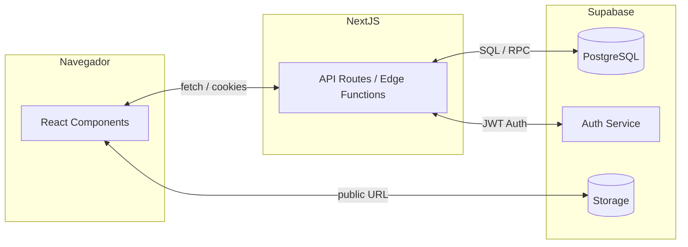
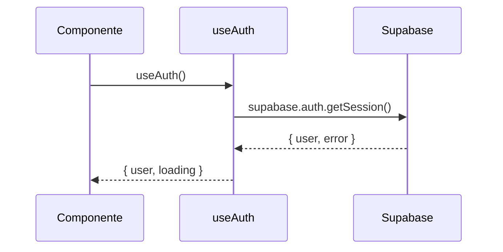

# DOCUMENTACION PROYECTO – GymTracker

> **Versión:** 2025-06-14
>
> Este documento cubre exhaustivamente la arquitectura, flujo de datos y detalles de implementación de GymTracker, una aplicación web construida con Next 13 **App Router** y **Supabase**. Toda la información se deriva del repositorio actual, sin omitir archivos relevantes.

[TOC]

---

## 1. Visión general del proyecto

GymTracker ayuda a los usuarios a:

* Registrar sus preferencias (objetivos, disponibilidad, equipamiento) mediante un cuestionario.
* Recibir recomendaciones automáticas de rutinas.
* Ejecutar y guardar resultados de entrenamientos.

Tecnologías clave:

* **Next 13 (App Router, React 18, TypeScript)**  
* **Supabase** (PostgreSQL, Auth, Row-Level Security, RPC)  
* **SWR** para data-fetching en el cliente  
* **Tailwind CSS + shadcn/ui** para UI  
* **Vitest** para tests unitarios  
* **Vercel** (preview + production) como hosting principal

---

## 2. Arquitectura de alto nivel



### Flujo de autenticación
1. El usuario se registra / inicia sesión mediante Supabase Auth (`/auth/*`).  
2. Supabase devuelve un **JWT** que Next almacena en cookies httponly.  
3. El middleware `src/middleware.ts` protege las rutas bajo `/(protected)` redirigiendo al login si el token es inválido.  
4. Los API routes "*server*" (`createServerClient`) leen la cookie y ejecutan consultas con RLS aplicadas.

---

## 3. Base de datos y seguridad

### Tablas principales

| Tabla | Campos clave | Relaciones |
|-------|--------------|------------|
| `user_answers` | `id uuid PK`, `user_id uuid FK auth.users`, `availability`, `goal`, `created_at` |   |
| `base_routines` | `id uuid PK`, `slug`, `name`, `description` |  |
| `base_routine_exercises` | `id uuid PK`, `routine_id FK base_routines`, `exercise_id FK exercises`, `sets`, `reps`, `sort_order` | Many-to-1 ↔ exercises/routines |
| `exercises` | `id int PK`, `name`, `gif_url`, `equipment`, ... |  |
| `routine_results` | `id uuid PK`, `routine_id FK base_routines`, `user_id FK auth.users`, `results JSONB`, `date` |  |

(Ver `src/lib/supabase/database.types.ts` para la definición completa generada por `supabase gen types`.)

### Índices relevantes
* PK/FK implícitos en cada tabla.  
* Índice compuesto `user_answers(user_id, created_at desc)` para historial.

### Row-Level Security (RLS)
Las tablas están en modo `SECURE BY DEFAULT`. Principales políticas:

```sql
-- user_answers: insertar sólo si el registro pertenece al usuario
CREATE POLICY "insert_own_answers"
  ON user_answers
  FOR INSERT
  WITH CHECK ( auth.uid() = user_id );

-- routine_results:  insertar y seleccionar propios
CREATE POLICY "access_own_routine_results"
  ON routine_results
  USING ( auth.uid() = user_id )
  WITH CHECK ( auth.uid() = user_id );
```

La carpeta `documentation/Persistencia-de-usuario.md` explica el razonamiento y muestra la política **"Insert own routine results"** creada cuando se detectó un error 500.

### Migraciones y seed
El proyecto utiliza el Panel de Supabase y `supabase gen types` en CI para mantener `database.types.ts`.  
Migraciones SQL viven en Supabase (no incluidas en repo). Para desarrollo local se recomienda:

```bash
supabase init  # crea supabase/migrations
supabase db push
```

---

## 4. Backend / API (Next 13 `src/app/api/*`)

| Ruta | Método | Descripción |
|------|--------|-------------|
| `/api/user-answers` | `GET` | Lista respuestas de un `user_id` (RLS, cookies). |
|  | `POST` | Inserta nuevas respuestas (service-role). Devuelve `{id}`. |
| `/api/recommend-routines-by-answer` | `GET` | Llama al RPC `recommend_routines_by_answer(answer_id)` y luego agrega ejercicios. |
| `/api/routine-results` | `POST` | Guarda resultados de una rutina. Requiere sesión válida. |
| `/api/exercises` | `GET` | Devuelve catálogo de ejercicios filtrable. |
| `/api/migrate-exercises` | `POST` | Script puntual de migración. |
| `/api/migrate-gifs` | `GET/POST` | Descarga y actualiza GIFs. |
| `/api/populate-routine` | `POST` | Seed de `base_routines`. |

### Ejemplo de uso (cURL)

```bash
# Obtener recomendaciones
curl -X GET \
  "https://<host>/api/recommend-routines-by-answer?answer_id=UUID"
```

### Manejo de errores y validación
* Todos los endpoints usan `NextResponse.json` con códigos `4xx/5xx` y mensaje.
* `try/catch` global y logging `console.error`.
* Validación de params obligatorios (`answer_id`, `user_id`, etc.).

---

## 5. Frontend (Next 13 App 
Router)

### Estructura
```
src/app/
  (auth)/            # login, register
  (protected)/       # dashboard protegido
  questionnaire/
  routine/
  progress/
```

#### Páginas clave

1. `questionnaire/page.tsx`
   * Renderiza `QuestionnaireForm`.
   * Obtiene `user.id` con `useAuth`.
   * Valida campos y tras `POST /api/user-answers` redirige al dashboard.

2. `routine/page.tsx`
   * Usa **SWR** para fetch `/api/recommend-routines-by-answer`.
   * Si no hay `answer_id`, busca la última respuesta del usuario.
   * Estados UI: *loading*, *error*, *empty*, *listado de ejercicios*.

3. `dashboard/page.tsx`
   * Lista historial (`UserAnswers`), link a `questionnaire`.

4. Layouts `(auth)/layout.tsx` y `(protected)/layout.tsx` envuelven páginas con `Navbar` y protegen rutas.

#### Componentes y hooks
* `components/ui/*` – shadcn wrappers (`button`, `card`, `input`, `select`, ...).
* `hooks/useAuth.tsx` – Contexto React con Supabase listener. Expuesto vía provider.
* `hooks/useTrainingPlan.ts` – memoiza rutina seleccionada.
* `context/*` – `AuthContext` y otros providers.

#### Estado y data-fetching
* **SWR** con `fetcher` genérico.
* Cookies JWT pasan automáticamente; no se envían headers adicionales.

#### Estilos
* **Tailwind CSS** configurado en `tailwind.config.ts`.
* Paleta OKLCH + Dark/Light via variables CSS.
* Componentes shadcn para consistencia.

---

## 6. Scripts y CI/CD

### NPM scripts (`package.json`)
* `dev` – `next dev`
* `build` – `next build`
* `start` – `next start`
* `lint` – `next lint`
* `test` – `vitest`

### Vitest
Archivo `vitest.config.ts` incluye coverage y setup en `vitest.setup.ts`.

### GitHub Actions / Vercel
A falta de workflows en repo, se confía en Integración Automática de Vercel:
1. Push a rama → Preview Deployment.  
2. `next build` + `supabase gen types` en postbuild.  
3. Merge a `main` → Producción.

---

## 7. Despliegue y entornos

| Variable | Descripción |
|----------|------------|
| `NEXT_PUBLIC_SUPABASE_URL` | URL REST de Supabase |
| `NEXT_PUBLIC_SUPABASE_ANON_KEY` | Public anon key |
| `SERVICE_ROLE_KEY` | Key con permisos de servicio (sólo en backend) |

### Local
```bash
# Requisitos
supabase version >=1.0
node 18+

# Arrancar
supabase start
npm run dev
```

### Vercel + Supabase Branches
* Cada *Preview Deployment* apunta a un *Branch Database* separado.  
* Production enlaza con la *main* branch.

---

## 8. Roadmap / ideas futuras

* Módulo de nutrición integrado (registro calórico).  
* Sincronización con wearables (Apple Health / Google Fit).  
* Suscripciones premium vía Stripe.  
* Cache de Edge Functions y revalidación (`next/headers` `revalidatePath`).  
* Recomendaciones basadas en ML (embeddings y similitud de respuestas).

---

# Anexos – Detallado por archivo

A continuación se listan los archivos más relevantes con explicación rápida. Para concisión se omiten los componentes UI auto-generados.

## `src/middleware.ts`
Controla acceso a rutas `(protected)`. Si `supabase.auth.getSession()` falla, redirige a `/auth/login`.

## `src/app/api/recommend-routines-by-answer/route.ts`
Pseudocódigo:
```typescript
GET /api/recommend-routines-by-answer?answer_id=UUID
  • Validar param
  • supabase.rpc('recommend_routines_by_answer')
  • SELECT base_routines + JOIN base_routine_exercises + exercises
  • Transformar orden → JSON optimizado
```
Edge cases:  
* `answer_id` inexistente → lista vacía.  
* RPC error → 500.

## `src/hooks/useAuth.tsx`
Mantiene estado global de auth.



## `src/app/routine/page.tsx`
1. Obtiene `answer_id` del search param o del último registro del usuario.  
2. `useSWR` → `/api/recommend-routines-by-answer`.  
3. Muestra lista de ejercicios ordenados.

## Test unitario de RLS (`src/tests/rls.spec.ts`)
Valida que un usuario no pueda insertar en `routine_results` si `user_id`≠ auth.uid().

---

© 2025 GymTracker Team. Todos los derechos reservados.
