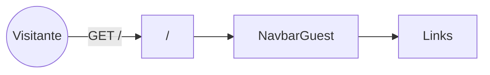
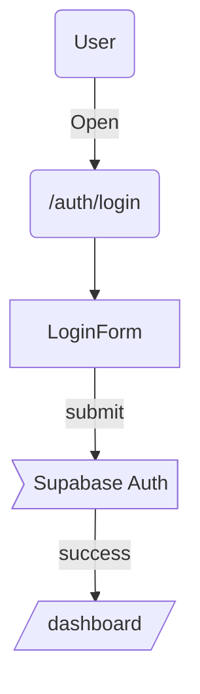

# Páginas de la aplicación

> Versión generada automáticamente el 14-06-2025

[TOC]

---

## / <!-- "/" -->
Ruta del archivo: `src/app/page.tsx`

Tipo de componente
🔵 **Server Component** (el componente `Main` importado contiene los fragmentos client, pero la página en sí es RSC).

### Propósito
Landing pública con navegación, hero, features, CTA y footer para presentar la herramienta *GymTracker*.

### Flujo de datos
* Sin `generateMetadata` extra (usa metadata del *RootLayout*).
* No consume endpoints directamente; los datos estáticos se pasan mediante props a los componentes UI.

### Componentes / Layouts implicados
* Hereda `src/app/layout.tsx` (provee tipografía, tema y `AuthProvider`).
* Renderiza `<Main>` que a su vez compone: `<NavbarGuest>`, `<Hero>`, `<FeaturesGrid>`, `<CTA>`, `<Footer>`.

### Navegación
Utiliza `<Link>` dentro de `NavbarGuest` hacia `auth/login`, `auth/register` y otras páginas internas.

### Autenticación / permisos
Pública, sin protecciones.

### SEO / Metadata
Define metadata global en `layout.tsx`; no sobrescribe.

### Ejemplo visual rápido


### Edge-cases
No aplica (página estática). Manejada por el error boundary global si fuese necesario.

### Archivos colaterales
* Usa `src/app/layout.tsx` para proveer contexto y fuentes.

---

## /auth/login
Ruta del archivo: `src/app/auth/login/page.tsx`

Tipo de componente
🔄 **Híbrido** (la página es RSC; `<LoginForm>` es *Client* para manejar estado y llamadas de autenticación).

### Propósito
Permitir al usuario iniciar sesión con email y contraseña (o proveedores OAuth) mediante Supabase Auth.

### Flujo de datos
* `LoginForm` replica estado controlado y llama al endpoint `/auth/v1/token` vía Supabase SDK.
* No se usa `useSWR`, pero `AuthProvider` escucha eventos `onAuthStateChange` para redirigir al dashboard.

### State locales / globales
* `LoginForm` maneja local state (`email`, `password`, `loading`).
* Estado global de auth provisto por React Context `AuthContext`.

### Componentes / Layouts implicados
* Hereda `src/app/layout.tsx`.
* Renderiza `<NavbarGuest>` (componente client) + `<LoginForm>`.

### Navegación y rutas hijas
* Link a `/auth/register`.  
* En éxito, `router.push('/dashboard')`.

### Autenticación / permisos
* Página debe estar accesible sólo cuando el usuario NO esté autenticado. El guardia se implementa en `middleware.ts` (redirecciona a `/dashboard` si ya está logueado).

### SEO / Metadata
No define metadata dinámica.

### Ejemplo visual


### Edge-cases
* Credenciales incorrectas → muestra `setError` en el form.
* Supabase fuera de línea → toast de error genérico.

### Archivos colaterales
No existen `loading.tsx` ni `error.tsx` locales.

---

## /auth/register
Ruta del archivo: `src/app/auth/register/page.tsx`

Tipo de componente
🔄 **Híbrido** (misma razón que *login*).

### Propósito
Crear cuentas nuevas en Supabase Auth y almacenar perfil básico.

### Flujo de datos
* `RegisterForm` maneja estado y llama `supabase.auth.signUp()`.
* Después del `signUp`, crea `profiles` row mediante RPC o `onAuthStateChange`.

### State, componentes y navegación
* Ídem *login* pero con validación extra (`confirmPassword`).
* Navega a `/dashboard` al completar email confirm.

### Autenticación / permisos
Debe estar restringida a usuarios NO autenticados (middleware).

### SEO / Metadata
Igual a login.

### Edge-cases
* Email ya registrado → muestra mensaje de error.

---

## /dashboard
Ruta del archivo: `src/app/dashboard/page.tsx`

Tipo de componente
🟠 **Client Component** (`"use client"`).

### Propósito
Panel principal tras login donde se muestran las respuestas más recientes y la rutina del día.

### Flujo de datos
* Hook `useUserAnswers` (SWR) → GET `/api/user-answers?user_id=...`.
* Local loader: muestra `<LoadingSpinner>` hasta recibir datos.
* Renderiza `<AnswerCard[]>` y `<TodayRoutine>` (placeholder).

### State
* Local: `loading`, `error` de `useUserAnswers`.
* Global: `AuthContext` para `user`.

### Componentes / Layout
* Hereda `dashboard/layout.tsx` (sidebar + flex container).  
* Hijo principal: `<AnswerCard>` grid. 

### Navegación
* Sidebar incluye `<Link>` a `/routine`, `/progress`, `/questionnaire`.

### Autenticación / permisos
Protegida por `middleware.ts` (requiere JWT).  
RLS para `user_answers` evita filtrar otras cuentas.

### SEO / Metadata
Dynamic title: "Dashboard" (definido en layout, opcional).

### Ejemplo visual
```mermaid
flowchart TD
  Login --> Dashboard
  Dashboard --> useUserAnswers --> API[/api/user-answers]
  Dashboard --> RoutinePage
```

### Edge-cases
* Si `answers.length === 0` → sugiere completar cuestionario.

### Archivos colaterales
`dashboard/layout.tsx` (🟠 client) comparte `<Sidebar>` con Progress y Routine.

---

## /progress
Ruta del archivo: `src/app/progress/page.tsx`

Tipo de componente
🔵 **Server Component** (simple placeholder).

### Propósito
Página donde se mostrará el historial y gráficas de progreso (pendiente de implementación).

### Flujo de datos
Sin lógica todavía; se añadirá graficado con D3/SWR.

### Componentes / Layout
* Hereda `progress/layout.tsx` (🟠 client) que re-usa `<Sidebar>`.

### Navegación
`Sidebar` enlaza a `/dashboard`, `/routine`.

### Autenticación / permisos
Protegida por middleware (requiere JWT).

### Edge-cases
Placeholder → sin manejo.

---

## /questionnaire
Ruta del archivo: `src/app/questionnaire/page.tsx`

Tipo de componente
🔄 **Híbrido** (RSC + `<QuestionnarieForm>` client para capturar preferencias).

### Propósito
Recolección de datos para generar rutinas personalizadas (objetivo, experiencia, disponibilidad…).

### Flujo de datos
* `<QuestionnarieForm>` administra estado local y onSubmit → `POST /api/user-answers`.
* Al éxito, `router.push('/routine?answer_id=<id>')`.

### State
* Local formik/React-hook-form validation.

### Layout y componentes
* Hereda root layout.  
* Incluye `<NavbarGuest>`.

### Autenticación / permisos
Pública, pero si usuario autenticado se muestra con sesión en AuthContext.

### Edge-cases
* Form validator impide enviar sin campos obligatorios.

---

## /routine
Ruta del archivo: `src/app/routine/page.tsx`

Tipo de componente
🟠 **Client Component** (`"use client"`).

### Propósito
Listar rutinas recomendadas basadas en la respuesta `answer_id` y permitir al usuario explorar detalles.

### Flujo de datos
1. Lee `answer_id` de `useSearchParams()`.
2. Si falta, intenta recuperar de `localStorage` o último cuestionario en Supabase.
3. Usa `useSWR` → `/api/recommend-routines-by-answer?answer_id=...`.
4. Renderiza `<RoutineList>` con tarjetas y enlaces a `/routine/[id]` (pendiente).

### State
* `checkingLast` (bool) mientras consulta último answer.
* SWR state: `isLoading`, `error`, `routines`.

### Componentes / Layout
* Hereda `routine/layout.tsx` con `<Sidebar>`.
* Hijo: `<RoutineList>` (grid de rutinas + fav button).

### Navegación y rutas hijas
* Ruta dinámica futura: `/routine/[routineId]` (no implementada aún).  
* Links generados con `<Link>` de Next.

### Autenticación / permisos
Protegida (solo usuarios). Verifica `AuthContext.user` y muestra loader si no.

### SEO / Metadata
Podría añadir dynamic title: "Rutinas recomendadas".

### Ejemplo visual
```mermaid
flowchart TD
  A(User) -->|/routine?answer_id| B[RoutinePage]
  B --> useSWR --> API[/api/recommend-routines-by-answer]
  B --> RoutineList --> Card --> '/routine/[id]'
```

### Componente `<RegenerateButton />`
Ubicación: `src/app/routine/components/RegenerateButton.tsx`

#### Propósito
Permite al usuario regenerar un plan de rutina existente. Al hacer clic, borra el plan actual asociado a `answer_id` para forzar la generación de uno nuevo.

#### Flujo de operación
1. Obtiene `answer_id` de `useSearchParams()`.
2. Si no hay `answer_id`, no renderiza nada (early return).
3. Al hacer clic:
   - Habilita estado `loading`
   - Envía `POST /api/regenerate-plan?answer_id=...`
   - Si hay error, muestra alerta
   - Si es exitoso, recarga la página con `window.location.reload()`

#### Estados
- `loading`: booleano que deshabilita el botón durante la petición

#### Dependencias
- `next/navigation` para `useSearchParams`
- `react` para estado local

#### Uso típico
```tsx
// En cualquier componente dentro de /routine
<RegenerateButton />
```

### Edge-cases
* Falta `answer_id` → componente no se renderiza.
* Error de API → muestra `alert` con mensaje de error.
* Lista vacía → copy de "sin recomendaciones".
* Usuario no autenticado → middleware redirige a login.

---

## Layouts globales sin `page.tsx`

### `src/app/layout.tsx` *(🔵 server)*
Proveedor global de fuentes, tema oscuro, y `<AuthProvider>`. Envuelve toda la app.

### `dashboard/layout.tsx`, `progress/layout.tsx`, `routine/layout.tsx` *(🟠 client)*
Comparten `<Sidebar>` fijado y definen contenedor `flex`.

---

## Comparativa rápida

| Ruta | Tipo | Necesita auth | Endpoint principal consumido |
|------|------|---------------|------------------------------|
| `/` | Server | No | — |
| `/auth/login` | Híbrido | No (redirige si logueado) | Supabase Auth | 
| `/auth/register` | Híbrido | No | Supabase Auth |
| `/dashboard` | Client | Sí | `/api/user-answers` |
| `/progress` | Server | Sí | — |
| `/questionnaire` | Híbrido | No (guarda answer) | `/api/user-answers` (POST) |
| `/routine` | Client | Sí | `/api/recommend-routines-by-answer` |

> **Leyenda:**
> *Server* → 🔵, *Client* → 🟠, *Híbrido* → 🔄.

---

Fin del documento.
